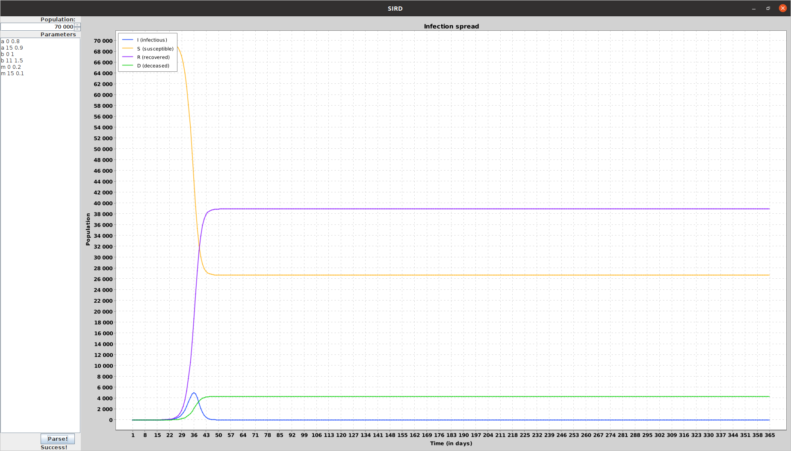
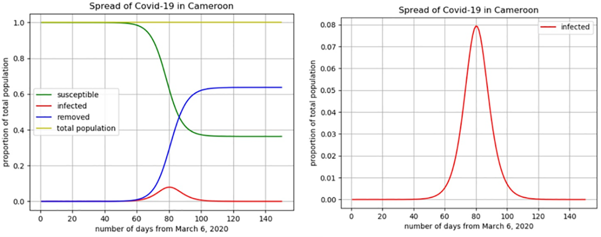
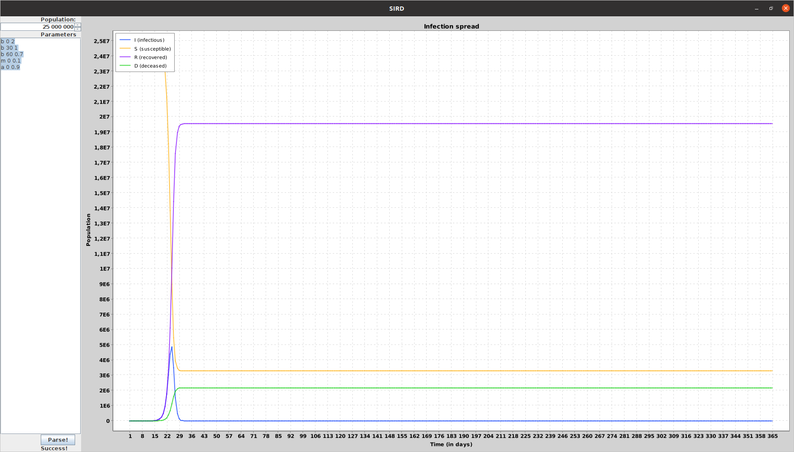
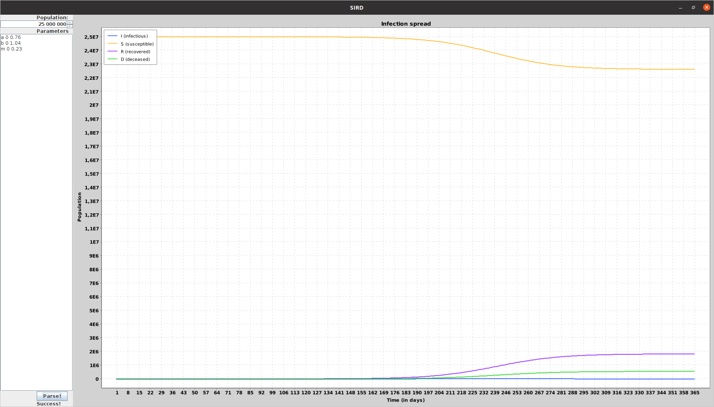

# Kermack-McKendrick (SIRD) model visualisator
## Definitions
### Variables
- **S** - the number of **s**usceptible individuals
- **I** - the number of **i**nfectious individuals
- **R** - the number of **r**ecovered (and immune) individuals
- **D** - the number of **d**eceased individuals
- **N** - the total number of individuals
### Parameters
- **alpha** (**a**) - is the average number of recovered individuals per time or **rate of recovery**
- **beta** (**b**) - is the average number of contacts per person per time or **rate of infection**
- **mu** (**m**) - is the average number of deceased individuals per time or **rate of mortality**
### Model
- **S'** = -beta * I * S / N
- **I'** = beta * I * S / N  - alpha * I - mu * I
- **R'** =  alpha * I
- **D'** = mu * I
## Example
- the total number of individuals is **70000**
- parameter **alpha** equals **0.8** till 15th day, then it equals **0.9**. In real life it means that doctors have learnt
how to heal infected people
- parameter **beta** equals **1** till 10th day, then it equals **1.5**. In real life it means that people have tired to self-isolate
- parameter **mu** equals **0.2** till 15th day, then it equals **0.1**                     

## Compare with Cameroon's statistics of Covid-19 spread
source: https://journals.plos.org/plosone/article?id=10.1371/journal.pone.0237832

### Choosing parameters
population 25 million, 6th march first covid infected
#### beta: 
- cameroon households have an average of 5 members
- from Wednesday 18 March 2020 air and sea borders were closed. Some other restrictions. Source: https://www.spm.gov.cm/site/?q=en/content/government-response-strategy-coronavirus-pandemic-covid-19
- On 10 April, the government took 7 additional measures to stop the spread of COVID-19 in Cameroon. These measures take effect from Monday, 13 April 2020. source: https://en.wikipedia.org/wiki/COVID-19_pandemic_in_Cameroon
#### mu:
- according to this article, average death rate of covid is 10%. This number is overrated for Africa. Source: https://ourworldindata.org/mortality-risk-covid#:~:text=Case%20fatality%20rate%20of%20COVID%2D19%20compared%20to%20other%20diseases,-How%20does%20the&text=The%20CFR%20of%20SARS%2DCoV,%25%20and%2034%25%2C%20respectively.
#### alpha:
- 90% are alive in average (according to taken mu)
So let's take such parameters
 `b 0 2`
 `b 30 1`
 `b 60 0.7`
 `m 0 0.1`
 `a 0 0.9`
### Building plot

### Evaluate parameters by real life data
Numbers from https://en.wikipedia.org/wiki/COVID-19_pandemic_in_Cameroon. 
Parameters were found using bruteforce.
Number of deceased and infected individuals after **30**, **60**, **90**, **180** days were taken
- alpha = 0.7680000000000006
- beta = 1.0400000000000007
- mu = 0.23199999999999943

  
